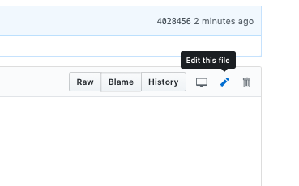
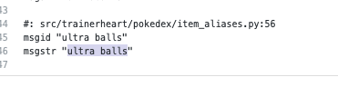
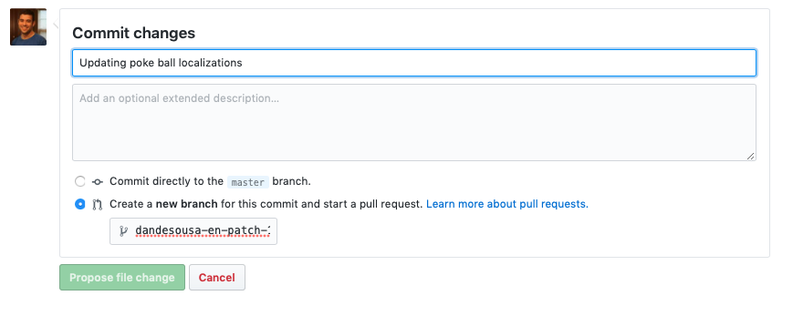

# pokenav-translations

Translations for the PokeNav discord bot and mobile application.

## Supported / Requested Languages

- Danish (da)
- Dutch (nl)
- English (en)
- French (fr)
- German (de)
- Portuguese (pt)
- Spanish (es)
- Polish (pl)

## Contributing

The easiest way for non-developer contributors to add translations is to go directly into the appropriate language directory under `locales`, select the language code and open the `bot.po` file. Hit edit in the upper right.

Fill in the `msgstr` fields with the appropriate translations. 

After these are done, you can submit the changes as a pull request and await approval. 

The changes should appear in the next bot release.
